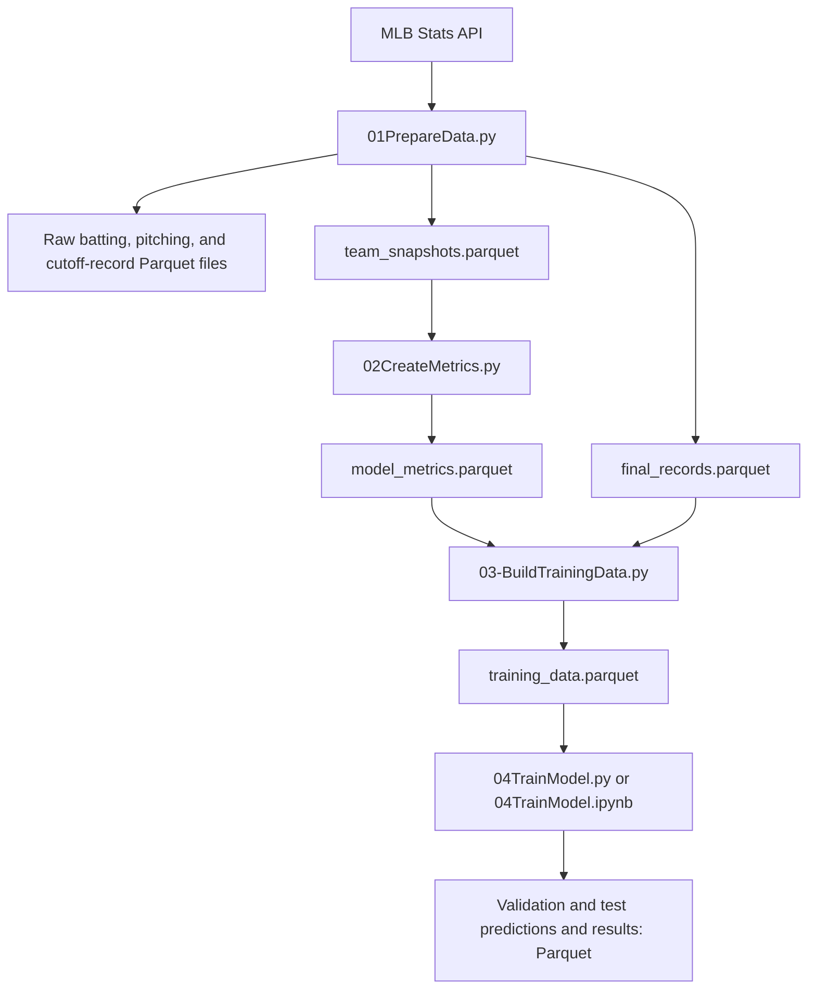

# Understanding the MLB Team Analysis Project

**A guide for a beginner programmer learning machine learning**  
**Reviewed:** September 6, 2026, Pacific/Honolulu  
**Scope:** the current 01–04 Python files, their notebooks, the saved Parquet data, and the existing tests.

This project asks whether a baseball team's performance up to July 1 can help predict its win percentage over the remaining regular season. It downloads historical observations, calculates useful measurements, constructs the outcomes we want to predict, and compares a small regression model with two simple guesses.

The structure is sensible for a learning project. It covers most of the essential steps of a small machine-learning experiment without requiring a database, a web application, or deep learning. Its current results show a small improvement over the benchmarks on one test season. They do not establish that it is a reliable general-purpose forecasting system.

You can read this guide in order, or keep it open beside the numbered files. Examples explicitly marked **hypothetical** teach a calculation; examples marked **observed** come from this project's saved data.

## Contents

1. [The problem in plain English](#1-the-problem-in-plain-english)
2. [The few ML concepts you need first](#2-the-few-ml-concepts-you-need-first)
3. [How the files fit together](#3-how-the-files-fit-together)
4. [Libraries, environments, and running the project](#4-libraries-environments-and-running-the-project)
5. [Python patterns used throughout the project](#5-python-patterns-used-throughout-the-project)
6. [01: Collecting the raw data](#6-01-collecting-the-raw-data)
7. [02: Turning observations into features](#7-02-turning-observations-into-features)
8. [03: Constructing the prediction target](#8-03-constructing-the-prediction-target)
9. [04: Training, choosing, and evaluating a model](#9-04-training-choosing-and-evaluating-a-model)
10. [A real team followed through the pipeline](#10-a-real-team-followed-through-the-pipeline)
11. [Understanding the current results](#11-understanding-the-current-results)
12. [A pandas reference for this code](#12-a-pandas-reference-for-this-code)
13. [Why these design choices were made](#13-why-these-design-choices-were-made)
14. [Checks, tests, and the current test problem](#14-checks-tests-and-the-current-test-problem)
15. [Limitations and common mistakes](#15-limitations-and-common-mistakes)
16. [A practical learning path](#16-a-practical-learning-path)
17. [Troubleshooting and glossary](#17-troubleshooting-and-glossary)

## 1. The problem in plain English

Imagine it is the end of July 1. You know a team's record and how it has hit and pitched so far. You do not yet know how it will play over the rest of the season.

Your prediction is a number such as `0.540`: the team is predicted to win 54% of its remaining decided games. It is not a prediction that the team will win its next game, and it is not its predicted final-season win percentage.

**Hypothetical example:** a team is 45–35 at the cutoff and later finishes 88–74.

```text
Wins after the cutoff:   88 - 45 = 43
Losses after the cutoff: 74 - 35 = 39
Remaining decided games: 43 + 39 = 82
Target:                  43 / 82 = 0.52439
```

The target is approximately **52.44%**, even though the team's cutoff win percentage was `45 / 80 = 56.25%`. Separating those two periods is the foundation of this project.

The downloaded data includes several cutoff dates. The first modeling experiment uses July 1 only. That choice keeps the first problem small and gives each prediction a roughly comparable amount of season left.

The code uses regular-season records. Its label denominator is remaining wins plus remaining losses, not a hard-coded `162 - G`. This makes the calculation follow recorded outcomes rather than assuming every team-season contains exactly the same number of decided games.

## 2. The few ML concepts you need first

### Observation, feature, and target

An **observation** is one example in your dataset. Here it is one team at one cutoff in one season.

A **feature** is information used to make a prediction. For example, estimated runs scored per game might help describe offensive performance.

A **target**, also called a **label**, is the answer you want the model to learn to predict. Here it is `remaining_win_pct`.

Programmers often call the table of features **X** and the column of targets **y**. Those letters are conventions, not special Python syntax.

```python
X = train[BASE_FEATURES]  # A table: one column per input feature.
y = train[TARGET]        # One column: the outcome for each row.
```

### What makes this supervised learning?

For past seasons, you have both the information available at the cutoff and the later outcome. Training uses those pairs to estimate a relationship. This is **supervised learning**: examples include answers.

The target is numeric, so this is a **regression** task. A classification task would instead predict a category such as “wins next game” or “does not win next game.” The current project does not train such a classifier.

### What actually learns?

The formulas in 02 are fixed arithmetic. They do not change because you give them more rows. The model in 04 learns numerical **coefficients** from the training examples.

```text
01: download observations
02: apply fixed feature formulas
03: calculate historical answers
04: learn coefficients and evaluate predictions
```

That distinction matters: creating a sophisticated feature is not itself evidence that a predictive model works.

### Prediction, error, and generalization

A **prediction** is the model's estimated target. An **error** is the difference between a prediction and the observed outcome. **Generalization** means making useful predictions for examples that were not used to fit or choose the model.

Good training performance alone does not demonstrate generalization. A model can fit patterns peculiar to its training examples; this is **overfitting**. That is why later seasons are set aside. See scikit-learn's [evaluation guidance](https://scikit-learn.org/stable/modules/cross_validation.html).

## 3. How the files fit together

### The complete data flow



Each arrow represents data being passed to the next step. The important boundary is that final records go to 03 for labels; 02 does not use them to build features.

### Files you work with

| File | Its job |
| --- | --- |
| `01PrepareData.py` | Download batting, pitching, cutoff standings, and final standings. |
| `02CreateMetrics.py` | Calculate features from the combined raw snapshots. |
| `03-BuildTrainingData.py` | Add the remaining-season outcome to the feature rows. |
| `04TrainModel.py` | Run the modeling experiment through small reusable functions. |
| `01PrepareData.ipynb` | Run 01 and inspect its saved data. |
| `02CreateMetrics.ipynb` | Run 02 and inspect its saved data. |
| `03.ipynb` | Run 03 and inspect its saved data. |
| `04TrainModel.ipynb` | Walk through the modeling calculations in separate code cells. |
| `test_pipeline.py` | Check mathematical and pipeline behavior with artificial examples; currently has a broken import, explained in section 14. |
| `README.md` | Short run instructions and a file inventory. |
| `.venv/` | The project's Python environment and installed packages. |

The current 04 script uses functions, while its notebook contains the calculations directly. They are separate implementations of the same experiment. Editing one does not automatically update the other. The 01–03 notebooks run their corresponding scripts with `%run`; that command belongs to IPython, the interactive Python environment used by these notebooks. See the [IPython `%run` documentation](https://ipython.readthedocs.io/en/stable/interactive/magics.html#magic-run).

### What is saved in Parquet?

These are the **observed shapes at review time**. A shape is `(number of rows, number of columns)`.

| Output under `data/` | Rows × columns | Meaning |
| --- | --- | --- |
| `batting_snapshots.parquet` | 1,140 × 36 | Batting statistics returned at each cutoff, with identifying columns. |
| `pitching_snapshots.parquet` | 1,140 × 63 | Pitching statistics returned at each cutoff. |
| `snapshot_records.parquet` | 1,140 × 5 | Cutoff season, date, team ID, wins, and losses. |
| `team_snapshots.parquet` | 1,140 × 96 | Those raw tables joined into one row per team/cutoff. |
| `final_records.parquet` | 300 × 4 | Season, team ID, final wins, and final losses. |
| `model_metrics.parquet` | 1,140 × 24 | Identifying information and 16 calculated features. |
| `training_data.parquet` | 1,140 × 30 | Metrics plus final records and remaining-season outcomes. |
| `validation_predictions.parquet` | 60 × 9 | Actual target and predictions for all four validation approaches. |
| `validation_results.parquet` | 4 × 3 | One MAE score row per validation approach. |
| `test_predictions.parquet` | 30 × 9 | Actual target, two benchmarks, chosen regression, and its absolute error. |
| `test_results.parquet` | 3 × 3 | MAE for the chosen regression and the two test benchmarks. |

There are ten seasons, 2016–2025. Nine have four collected cutoffs; 2020 has two. Therefore `(9 × 4 + 2) × 30 = 1,140` snapshots. The 300 final records are ten seasons times 30 teams.

“Raw” here means source statistics before this project's feature engineering. It does not mean individual pitch events or a complete archive of the original API messages. Some returned raw fields are already statistics calculated by the provider, such as averages. This pipeline saves tables, not raw response JSON.

## 4. Libraries, environments, and running the project

### What each library contributes

| Tool | Role in this project | Installation/import distinction |
| --- | --- | --- |
| Python | Runs the programs and supplies lists, dictionaries, functions, loops, and arithmetic. | The interpreter, not an extra package. |
| `pathlib` | Constructs paths to the `data` directory and files. | Part of Python's standard library. |
| pandas | Stores tables, joins them, filters rows, calculates columns, and reads/writes Parquet. | Installed as `pandas`, imported as `pandas` or the alias `pd`. |
| MLB-StatsAPI | Provides the `statsapi.get` and `statsapi.standings_data` functions. | Installed as `MLB-StatsAPI`, imported as `statsapi`. |
| scikit-learn | Fits linear regression and calculates MAE. | Installed as `scikit-learn`, imported from `sklearn`. |
| PyArrow | Provides the Parquet engine used by pandas in this environment. | Installed as `pyarrow`; no explicit import is needed in the numbered scripts. |
| NumPy | Supplies numerical arrays used by scikit-learn and numerical test helpers. | Explicitly imported in the test file; also used beneath other libraries. |
| IPython/Jupyter kernel | Executes notebook cells and commands such as `%run`. | A notebook's selected kernel determines which Python environment runs its code. |
| `unittest` and `importlib` | Support the existing tests and module loading. | Part of Python's standard library. |

The `statsapi` package is a community-maintained Python wrapper around MLB's API; it is not the same thing as the MLB service itself. The wrapper's [repository](https://github.com/toddrob99/MLB-StatsAPI) documents that distinction and its installation.

### Why Parquet?

Parquet is a binary, column-oriented table format with support for compression and column types. It is useful when programs will repeatedly read and write analytical tables. You inspect it with a dataframe viewer or pandas rather than expecting to read it as plain text. See [Apache Parquet's overview](https://parquet.apache.org/docs/overview/).

```python
data = pd.read_parquet(DATA_DIR / "training_data.parquet")
data.to_parquet(DATA_DIR / "example.parquet", index=False)
```

The second line writes a file; it is an illustration, not a required pipeline step. `index=False` excludes the dataframe's row index from the saved data. It does not remove `Team_ID`, because that is a normal column. pandas requires a Parquet engine such as PyArrow; the installed environment supplies it. See [pandas `to_parquet`](https://pandas.pydata.org/docs/reference/api/pandas.DataFrame.to_parquet.html).

At this project's size, Parquet is mainly a clear, convenient storage choice. No local benchmark was performed to claim a particular speed advantage over CSV.

### Use the existing WSL environment

This workspace is stored inside Ubuntu under WSL. The following commands are for an **Ubuntu/bash terminal**, not PowerShell:

```bash
cd "/home/max/programming/ML/Team Analysis"
source .venv/bin/activate
python --version
```

A virtual environment keeps this project's installed packages separate from other Python environments. Activating it makes the terminal's `python` command use that environment. `python -m pip` uses pip associated with that Python interpreter. See Python's [virtual environment guide](https://docs.python.org/3/tutorial/venv.html).

The environment already exists. If rebuilding the project in a new location, the minimal installation approach is:

```bash
python3 -m venv .venv
source .venv/bin/activate
python -m pip install pandas pyarrow MLB-StatsAPI scikit-learn ipykernel
```

You still need a notebook-capable editor to use `.ipynb` files. Choose the project's `.venv` as its kernel. To inspect the actual interpreter from a notebook:

```python
import sys
print(sys.executable)
```

Versions observed during this review: Python **3.12.3**, pandas **3.0.5**, NumPy **2.5.2**, PyArrow **25.0.1**, MLB-StatsAPI **1.9.0**, and scikit-learn **1.9.0**. These record the reviewed environment; they are not a claim that all future versions behave identically. There is currently no checked-in dependency lock file.

### Run in order

```bash
python 01PrepareData.py
python 02CreateMetrics.py
python 03-BuildTrainingData.py
python 04TrainModel.py
```

01 needs internet access and downloads the configured history again. 02–04 use local Parquet inputs. Each stage replaces its own named outputs when it reaches the save operations.

If you only change the model, rerun 04. If you change a feature formula, rerun 02, 03, and 04. If you change the collected data, rerun the whole sequence. Running a notebook and the corresponding script is not necessary to obtain two different results; they are alternative ways of running the stages.

## 5. Python patterns used throughout the project

### Imports, objects, and methods

```python
import pandas as pd
from sklearn.linear_model import LinearRegression
```

`pd` is a short local name for the pandas module. `LinearRegression` is a class supplied by scikit-learn. `LinearRegression()` creates a model object; `model.fit(...)` calls a method on that object. An object holds related information and behavior together.

A dataframe is also an object. `df.columns` accesses an attribute; `df.head()` calls a method. Parentheses are the visible difference in these examples.

### Lists and dictionaries

01 uses a list to collect many rows and a dictionary to describe each row:

```python
rows = []
row = {"Season": season, "Team_ID": team_id}
rows.append(row)
```

A list is an ordered collection. A dictionary associates keys with values. `row.update(split["stat"])` adds the statistic entries into the row dictionary. `rows.append(row)` adds that dictionary as one list item. `pd.DataFrame(rows)` turns the collected dictionaries into a table. Python's [data structures tutorial](https://docs.python.org/3/tutorial/datastructures.html) explains the underlying list and dictionary operations.

### Loops, range, conditions, and formatting

```python
for season in range(2016, 2026):
    for month in (6, 7, 8, 9):
        if season == 2020 and month < 8:
            continue
        cutoff = f"{season}-{month:02d}-01"
```

This is the collection schedule expressed in Python. `range` excludes its endpoint, so the last season is 2025. The inner loop visits four months. `continue` skips the rest of that loop iteration. The f-string inserts the values into text, and `02d` formats month 6 as `06`.

The indentation is part of the program: it determines which statements belong inside each loop or condition.

### Functions and return values

```python
def fit_regression(data, features):
    model = LinearRegression()
    model.fit(data[features], data[TARGET])
    return model
```

`data` and `features` are parameters. Calling the function supplies arguments for them. `return model` sends the fitted object back to the caller. The function does not run merely because Python reads its definition.

04 uses functions to give each task a name and avoid duplicating operations. For example, both the validation models and the final refitted model use `fit_regression`.

### The compact dictionary loop in 04

```python
models = {
    name: fit_regression(train, features)
    for name, features in MODEL_FEATURES.items()
}
```

This dictionary comprehension is equivalent to the following longer form:

```python
models = {}
for name, features in MODEL_FEATURES.items():
    models[name] = fit_regression(train, features)
```

Both create a dictionary that connects each model name to a fitted model. `.items()` visits a dictionary's key/value pairs. The names matter because `make_predictions` uses them to look up the correct feature columns.

### Paths and the main function

```python
DATA_DIR = Path(__file__).resolve().parent / "data"
```

In a Python script, `__file__` identifies that script. `resolve()` makes the path absolute and resolves links; `.parent` gets its directory; `/ "data"` joins a child path. It is path construction, not numerical division. `mkdir(exist_ok=True)` creates the directory and tolerates an existing directory. See [Python `pathlib`](https://docs.python.org/3/library/pathlib.html).

The 04 notebook uses `Path("data")`, which starts from its working directory. That is why the notebook should run from the project folder.

```python
if __name__ == "__main__":
    main()
```

This pattern calls `main()` when the file is run as a script. Importing the module makes its definitions available without automatically starting the pipeline.

## 6. 01: Collecting the raw data

### What is an API request?

An API is an interface through which your program requests data from another service. Instead of manually copying a table from a website, the code sends parameters and receives structured data.

The installed wrapper maps `"teams_stats"` to MLB's team-statistics endpoint. The request uses these parameters:

| Parameter in this project | Purpose |
| --- | --- |
| `group` | Request hitting or pitching statistics. |
| `stats="byDateRange"` | Request statistics for a date interval. |
| `season` | Identify the historical season. |
| `sportIds=1` | Restrict the request to MLB. |
| `gameType="R"` | Restrict to regular-season games. |
| `startDate` | January 1 of that season, capturing its regular-season games from the start. |
| `endDate` | The chosen cutoff date. |

These parameter names are documented in the wrapper's [endpoint reference](https://github.com/toddrob99/MLB-StatsAPI/wiki/Endpoints) and were checked against its installed endpoint definition.

The project treats the cutoff as inclusive: its statistics and standings use that date. A prediction made before that day's games would require an earlier cutoff. This review checked code and saved tables, not the timing of every individual game or historical source correction.

### `get_team_stats(season, cutoff, group)`

This function requests one group of team statistics for one cutoff. The response contains nested dictionaries and lists. In:

```python
response["stats"][0]["splits"]
```

`["stats"]` accesses a dictionary entry, `[0]` selects the first item of a list, and `["splits"]` accesses that item's split records. The loop creates one row for each returned team split. It preserves all fields in `split["stat"]` and adds season, cutoff, team ID, and team name.

The function expects 30 rows and raises an error otherwise. This is a deliberate assumption for the chosen MLB seasons, not a general rule for every possible baseball dataset. The code assumes the needed group is the first statistics block; it is not a general parser for arbitrary API responses.

### `get_records(season, cutoff=None)`

This calls `statsapi.standings_data`, which returns standings organized by division. It extracts team IDs, wins, and losses. `int(...)` converts the record values into integers.

With a date, the function requests cutoff standings and adds `Cutoff_Date`. Without a date, it requests the season standings. Those are final outcomes only when the selected season is complete. The current dates stop at 2025; simply adding an unfinished year would not magically create final labels. See the wrapper's [`standings_data` documentation](https://github.com/toddrob99/MLB-StatsAPI/wiki/Function:-standings_data).

### `combine_snapshot(batting, pitching, records)`

The three tables are matched using:

```python
keys = ["Season", "Cutoff_Date", "Team_ID"]
```

Those columns form the **key**, the information that identifies one observation. `Team_ID` is more suitable for matching than a team name, whose wording can change.

`merge` adds related columns by matching keys. Its default is an inner join, keeping matching keys on both sides. `validate="one_to_one"` checks that keys are unique in each input. The subsequent 30-row check catches lost rows for the expected scope. Shared column names receive `_bat` and `_pitch` suffixes. These are [documented pandas merge behaviors](https://pandas.pydata.org/docs/reference/api/pandas.DataFrame.merge.html).

For example, `hits_bat` means the team's batting hits; `hits_pitch` means hits allowed by its pitching. The code checks that batting and pitching games played match, keeps the batting team name as `Team`, and renames batting games played to `G`.

### `main()` and concatenation

The outer loop visits seasons; the inner loop visits cutoffs. For each cutoff it collects three tables and builds a combined snapshot. Final records are fetched once per season.

`pd.concat(..., ignore_index=True)` stacks the cutoff tables underneath one another. It does not match teams by keys. The `ignore_index` argument produces a fresh row index. Thus **merge adds related information across columns; concat stacks examples across rows** in this project. See [pandas `concat`](https://pandas.pydata.org/docs/reference/api/pandas.concat.html).

Only after collection and concatenation does 01 save its five Parquet outputs. There is no incremental cache or automatic retry loop in the script. A failed download can stop the run before updated tables are saved; previous files may still be present.

## 7. 02: Turning observations into features

### Why calculate rates?

Raw counts depend on opportunities. In a **hypothetical** comparison, 100 strikeouts against 500 batters is a rate of 20%; 90 against 300 batters is 30%. A count-only comparison hides that difference.

02 divides by games, plate appearances, batters faced, or at-bats depending on the question. Rates make rows easier to compare, but do not eliminate uncertainty: a rate from very few opportunities can still be unstable.

### The baseball terms used by the formulas

| Term | Meaning in the code |
| --- | --- |
| `G` | Games played. |
| `W`, `L` | Wins and losses through the cutoff. |
| H / `hits` | Hits. |
| BB / `baseOnBalls` | Walks. |
| K / `strikeOuts` | Strikeouts. |
| HR / `homeRuns` | Home runs. |
| HBP / `hitByPitch` | Hit-by-pitch count. |
| IBB / `intentionalWalks` | Intentional walks. |
| TB / `totalBases` | Bases credited from hits. |
| SB, CS | Stolen bases and caught stealing. |
| GDP | Grounded-into-double-play count. |
| SF, SH | Sacrifice flies and sacrifice bunts. |
| PA | Completed batting appearances. |
| BF / `battersFaced` | Batting opponents faced by the pitching staff. |
| AB / `atBats` | Official at-bats. |

Plate appearances include outcomes that are not official at-bats. Walks, for example, count as appearances but not at-bats. See MLB's [plate appearance](https://www.mlb.com/glossary/standard-stats/plate-appearance) and [at-bat](https://www.mlb.com/glossary/standard-stats/at-bat) definitions.

### All 16 calculated features

These formulas describe the implementation in `build_metrics`.

| Feature | Calculation or interpretation |
| --- | --- |
| `off_xbsr_per_game` | Adjusted offensive BaseRuns divided by games. |
| `allowed_xbsr_per_game` | Adjusted BaseRuns allowed divided by games. |
| `xrun_diff_per_game` | Offensive BaseRuns/game minus allowed BaseRuns/game. |
| `win_pct` | `W / (W + L)`. |
| `runs_scored_per_game` | `runs_bat / G`. |
| `runs_allowed_per_game` | `runs_pitch / G`. |
| `run_diff_per_game` | Actual runs scored/game minus allowed/game. |
| `bat_k_rate` | Batting strikeouts / plate appearances. |
| `bat_bb_rate` | Batting walks / plate appearances. |
| `bat_hr_rate` | Batting home runs / plate appearances. |
| `pitch_k_rate` | Pitching strikeouts / batters faced. |
| `pitch_bb_rate` | Walks allowed / batters faced. |
| `pitch_hr_rate` | Home runs allowed / batters faced. |
| `pitch_k_minus_bb_rate` | Pitching strikeout rate minus walk rate. |
| `bat_iso` | `(totalBases_bat - hits_bat) / atBats_bat`. |
| `pitch_iso` | The same calculation for batting production allowed. |

ISO measures extra bases per at-bat. MLB also expresses it as slugging percentage minus batting average. See [MLB's ISO definition](https://www.mlb.com/glossary/advanced-stats/isolated-power).

The code's ISO formula follows directly: slugging is total bases per at-bat and batting average is hits per at-bat, so their difference has numerator `totalBases - hits`. As an arithmetic example, subtracting one hit from the four bases credited for a home run leaves three extra bases.

### `get_league` and `map`

`get_league(team_id)` returns `AL` or `NL` using the two lists of team IDs. An unknown ID raises an error. `df["Team_ID"].map(get_league)` applies that function to each ID and creates the `League` column. See [pandas `Series.map`](https://pandas.pydata.org/docs/reference/api/pandas.Series.map.html).

The lists are a convenient historical assumption for the project's scope. They are not a downloaded history of team affiliations.

### `raw_bsr`: understanding BaseRuns

BaseRuns estimates scoring from recorded offensive events. The project applies it to both team batting and batting allowed. It is a feature formula; the regression later determines how these estimates relate to future results. FanGraphs explicitly distinguishes its year-to-date BaseRuns calculation from a projection system. See [FanGraphs BaseRuns](https://library.fangraphs.com/features/baseruns/).

The formula in the project's source is:

```text
A = H + BB + HBP - 0.5*IBB - HR
B = 1.1 * (1.4*TB - 0.6*H - 3*HR
           + 0.1*(BB + HBP - IBB)
           + 0.9*(SB - CS - GDP))
C = appearances - BB - SF - SH - HBP - H + CS + GDP
D = HR

raw_bsr = A*B / (B+C) + D
```

In the documented interpretation, A describes baserunners, B models advancement, C describes outs, and D accounts for home runs. The fixed coefficients are part of the chosen BaseRuns formula. **04 does not learn those coefficients.** It learns a separate regression on the resulting features.

In this implementation, `appearances` is `plateAppearances` for batting and `battersFaced` for pitching. `side="bat"` or `side="pitch"` controls which suffixed columns are used. This avoids writing the same arithmetic twice.

### `adjusted_bsr_per_game`: totals for the right comparison group

The function groups by `Season`, `Cutoff_Date`, and `League`, separately for offense and pitching. It calculates:

```text
adjustment = group actual runs / group raw BaseRuns
team adjusted BaseRuns/game = team raw BaseRuns * adjustment / team games
```

The league adjustment follows the [FanGraphs calculation](https://library.fangraphs.com/features/baseruns/). The extra cutoff grouping in this project prevents one date's totals from being mixed with another date's totals.

This line deserves attention:

```python
league_raw_bsr = groups["raw_bsr"].transform("sum")
```

Unlike a normal grouped sum, `transform("sum")` returns a value aligned with every original row. Each team receives its group's total. A **hypothetical** group containing values 10, 20, and 30 gets transformed values 60, 60, and 60. That lets the following division work row by row. See [pandas group transformations](https://pandas.pydata.org/docs/reference/api/pandas.core.groupby.DataFrameGroupBy.transform.html).

Computing this factor from same-cutoff observations is different from fitting a scaler using future outcomes. The intended forecast has all teams' current statistics available. It does mean this feature function expects the full league context; passing it just one team is not supported.

### `build_metrics` and `main`

`build_metrics` copies the input, attaches the league, checks for duplicate keys and 30 rows per cutoff, selects identifying columns, and adds the 16 feature columns. It converts infinities into missing values and stops if any output value is missing. Finally it sorts the rows and resets their index.

`main()` reads `team_snapshots.parquet`, calls that function, and saves `model_metrics.parquet`. No API requests or model fitting occur here.

`FEATURE_SETS` lists possible feature combinations. **04 does not import that dictionary.** Its own `BASE_FEATURES`, `EXTENDED_FEATURES`, and `MODEL_FEATURES` determine what is actually trained. Changing a list in 02 alone will not change the experiment in 04.

## 8. 03: Constructing the prediction target

### Why this deserves a separate stage

02 answers “What did the team look like at the cutoff?” 03 adds “What happened afterward?” Keeping those responsibilities separate makes it easier to see which information belongs on which side of a prediction.

`build_training_data(metrics, final_records)` uses a left merge on `Season` and `Team_ID`. Many cutoff rows can match the same final record, so the relationship is `many_to_one`. The left join keeps the feature rows, allowing missing final records to be detected explicitly rather than silently dropping them. See [pandas merge validation](https://pandas.pydata.org/docs/reference/api/pandas.DataFrame.merge.html).

The calculation is:

```python
training["remaining_wins"] = training["final_W"] - training["W"]
training["remaining_losses"] = training["final_L"] - training["L"]
training["remaining_games"] = training["remaining_wins"] + training["remaining_losses"]
```

If either difference is negative, a cutoff record is inconsistent with its final record and the function stops. Rows with no remaining games are excluded because they have no defined remaining-season win percentage. The target is then `remaining_wins / remaining_games`.

`main()` loads the two inputs, calls the function, and saves `training_data.parquet`.

### Why final results can be stored but must not be predictors

A historical dataset needs the true answers so you can train and evaluate. Storing them alongside the features is convenient. The safeguard is explicit column selection when constructing X.

For this project:

```python
model.fit(data[features], data[TARGET])
```

The left argument uses only the feature names. The right argument supplies the target separately. Passing the whole training table as X would expose future results, identifiers, and text columns. In particular, `remaining_games` in this dataset is calculated from final records; it is not a schedule forecast known at the cutoff.

Using information unavailable at prediction time is **data leakage**. It can make a model look much better than it really is. scikit-learn's [common pitfalls guide](https://scikit-learn.org/stable/common_pitfalls.html#data-leakage) explains why train/test separation and preprocessing boundaries matter.

## 9. 04: Training, choosing, and evaluating a model

### The function map

The current script is organized into these functions. The notebook expresses the same experiment as sequential cells.

| Function | What it receives | What it does or returns |
| --- | --- | --- |
| `load_july_data(data_dir)` | A directory path. | Loads training data, keeps July 1 in 2016–2025 excluding 2020, sorts and checks it, returns the filtered table. |
| `split_by_season(july)` | The July table. | Returns training, validation, and test tables; checks their expected row counts. |
| `print_split_summary(train, validation, test)` | The three tables. | Prints their intended years and sizes. |
| `fit_regression(data, features)` | Training rows and a list of feature names. | Creates and fits a `LinearRegression` object, then returns it. |
| `make_predictions(data, models)` | Rows to predict and a dictionary of fitted models. | Adds the two benchmark predictions and each model's predictions to identifying columns and the actual target. |
| `score_predictions(predictions, model_names)` | Prediction rows and names to score. | Returns one MAE row per approach. |
| `select_regression(validation_results)` | Validation scores. | Returns `baseruns` or `baseruns_k_bb`, preferring the simpler model on a tie. |
| `print_test_results(test_predictions, test_results, selected_name)` | Final evaluation outputs. | Prints the comparisons and the six largest selected-model errors. |
| `save_results(...)` | The four output tables and selected name. | Saves them as Parquet and checks the saved test MAE. |
| `main()` | No arguments. | Calls the functions in the intended order. |

### Loading July rows

```python
cutoff_dates = pd.to_datetime(data["Cutoff_Date"])
july = data[cutoff_dates.dt.strftime("%m-%d") == "07-01"].copy()
```

`to_datetime` parses the date column. The `.dt` accessor provides date operations for its values. `strftime("%m-%d")` turns each date into month-day text, making the July 1 comparison explicit. See [pandas datetime conversion](https://pandas.pydata.org/docs/reference/api/pandas.to_datetime.html).

The comparison produces a column of booleans. `data[condition]` keeps rows where the condition is true. Further filters exclude 2020 and limit seasons to the intended range. There are 270 July rows: nine seasons times 30 teams.

### Three separate time periods

| Split | Seasons | Rows | Purpose |
| --- | --- | --- | --- |
| Training | 2016, 2017, 2018, 2019, 2021, 2022 | 180 | Learn coefficients. |
| Validation | 2023, 2024 | 60 | Choose the regression feature set. |
| Test | 2025 | 30 | Evaluate the chosen procedure. |

The row counts are hard-coded assertions in 04. They are checks for this experiment, not automatically calculated design settings. If you change the experiment's years, the filters and assertions need to agree.

Why not randomly split rows? In the full data, a team's June and July snapshots overlap. Even with July only, a chronological split directly tests the intended use: learning from earlier seasons and predicting a later season. Keeping a whole season together also avoids dividing same-season teams across fitting and testing. See [scikit-learn's time-series evaluation discussion](https://scikit-learn.org/stable/modules/cross_validation.html#cross-validation-of-time-series-data).

The 270 July observations still are not 270 perfectly independent experiments. Teams play one another, and organizations recur across seasons. The split is a sensible beginner design, not a proof of independence.

### What `LinearRegression()` learns

The extended version predicts with an equation of this form:

```text
predicted remaining win percentage
    = intercept
    + coefficient_1 * offensive BaseRuns per game
    + coefficient_2 * allowed BaseRuns per game
    + coefficient_3 * pitching K-minus-BB rate
```

`LinearRegression` performs ordinary least squares: it chooses coefficients to minimize the sum of squared residuals on the training rows. A residual is actual minus predicted. By default, it also fits an intercept and does not force coefficients to be positive. See [the official estimator reference](https://scikit-learn.org/stable/modules/generated/sklearn.linear_model.LinearRegression.html).

The script does not implement an epoch loop, choose a learning rate, or build a neural network. It delegates the regression calculation to the library.

For a **hypothetical** pair of residuals `0.10` and `-0.10`, squared errors are `0.01` and `0.01`. Squaring prevents positive and negative misses from canceling and gives larger misses more influence on the fitted solution.

**Fitting uses squared error; model comparison uses MAE.** Those are different choices. It is legitimate to train with one objective and judge the result with another, but `LinearRegression` is not secretly minimizing MAE. The project's scoring function does not change its fitting objective.

### `fit` versus `predict`

```python
model.fit(train[features], train[TARGET])
predictions = model.predict(validation[features])
```

`fit` uses known answers to learn parameters. `predict` uses the learned parameters and new feature rows to calculate estimates. It does not receive validation answers. `predict` returns a numerical array, which the code assigns to a dataframe column.

The supplied input columns must mean the same things and have the same order as during fitting. `MODEL_FEATURES[name]` provides a consistent list for each named model. This also makes it clear why defining a new model name requires adding the matching feature entry.

### Why there is no scaler in this first model

No standardization is applied. For an unregularized linear model with an intercept and suitable numerical rank, rescaling a feature can be offset by rescaling its coefficient. Scaling is therefore not an automatic prerequisite for this small ordinary-least-squares example.

That does not make scaling universally unnecessary. It can matter for numerical conditioning, penalized models such as Ridge, and algorithms based on distances. Correlated inputs also make individual coefficients harder to interpret. See [scikit-learn's ordinary-least-squares discussion](https://scikit-learn.org/stable/modules/linear_model.html#ordinary-least-squares).

If you introduce a learned scaler later, fit it on the training data and apply those learned settings to validation/test data. Do not calculate its parameters using future test rows. The same principle applies to learned missing-value replacements and feature selection. See [preprocessing and leakage](https://scikit-learn.org/stable/common_pitfalls.html).

### Why clip the predictions?

```python
model.predict(data[MODEL_FEATURES[name]]).clip(0, 1)
```

A linear equation has no built-in bounds. Clipping changes a negative prediction to 0 and a prediction above 1 to 1; values inside the interval remain unchanged. The same rule is applied before validation and test scoring. See [NumPy's clipping operation](https://numpy.org/doc/stable/reference/generated/numpy.clip.html).

This enforces a sensible range for a win fraction. It does not turn the model into a calibrated next-game probability model, establish uncertainty intervals, or guarantee realistic forecasts.

### Benchmarks: the model must earn its complexity

The code always computes two predictions requiring no fitted regression:

- `always_500`: predict `0.5` for every team.
- `current_win_pct`: predict the team's cutoff win percentage for its remaining season.

These represent useful questions: does learning from statistics beat assuming average performance, and does it beat carrying the current record forward? They are fixed reference rules, not optimized versions of every possible baseline. A future experiment could add a prediction that shrinks current performance toward .500.

### Scoring with MAE

```python
mae = mean_absolute_error(predictions[TARGET], predictions[name])
```

MAE averages the absolute difference between actual and predicted values. Its units match the target. Here `0.05` means five percentage points of win percentage, not five wins and not “95% accuracy.” Lower is better. See [scikit-learn MAE](https://scikit-learn.org/stable/modules/generated/sklearn.metrics.mean_absolute_error.html).

**Hypothetical example:** actual outcomes are `[0.60, 0.40, 0.50]`; predictions are `[0.55, 0.50, 0.45]`.

```text
Absolute errors: 0.05, 0.10, 0.05
MAE = (0.05 + 0.10 + 0.05) / 3 = 0.06667
MAE in percentage points = 6.667
```

All team-season rows receive equal weight. Teams with slightly different remaining-game counts still each contribute one error. This is a deliberate evaluation convention, not a game-weighted score.

### Selecting and refitting

`select_regression` compares only the two regression rows in the validation results. It uses strict `<`, so an exact tie selects `baseruns`. It does not select a benchmark as the final model even if a benchmark wins; the printed test comparison can therefore truthfully say the selected regression failed to beat both benchmarks.

Once the feature set is chosen, the script concatenates training and validation rows. That creates 240 rows from the eight included seasons through 2024. It fits a new instance of the chosen regression on those rows, then predicts 2025.

The two candidate models were fitted on 180 rows. The final chosen version is refitted on 240. The final coefficients consequently need not equal the candidate's validation-stage coefficients.

This refit is allowed because the feature choice has already been made and all refit rows precede the test year. The 2025 outcomes do not participate in that decision. Once a person has examined the test result, however, repeated changes guided by it make 2025 part of the development process. It is no longer an untouched final test.

### What gets saved—and what does not

04 writes the four prediction/result Parquet tables. Prediction tables retain the actual target for evaluation; they are not unlabelled live forecasts. Result tables contain `model`, `mae`, and `mae_percentage_points`.

The chosen prediction column is named `baseruns` or `baseruns_k_bb`. `absolute_error` in the test table is the chosen regression's error. It is not the benchmark error and is not a training feature.

The fitted Python model object is not saved to disk. There is no model-serving application or current-season forecast file. The code can refit from the saved training data when you run it again.

## 10. A real team followed through the pipeline

This **observed example** uses the saved Cleveland Guardians row for July 1, 2025. It illustrates a large miss rather than a cherry-picked success.

| Field | Saved value, rounded where appropriate |
| --- | --- |
| `Team_ID` | 114 |
| Cutoff wins and losses | 40–43 |
| `G` | 83 |
| Current win percentage | `40 / 83 = 0.481928` |
| Offensive BaseRuns per game | 3.686439 |
| Allowed BaseRuns per game | 4.525454 |
| Pitching K-minus-BB rate | 0.123492 |
| Final wins and losses | 88–74 |
| Remaining wins and losses | 48–31 |
| Actual target | `48 / 79 = 0.607595` |
| Selected model's prediction | 0.441789 |
| Absolute error | 0.165806, or 16.58 percentage points |

01 supplies the cutoff measurements and final records. 02 supplies the three selected features. 03 calculates the actual outcome. 04 supplies the prediction and error.

Refitting the selected extended regression on the same saved training and validation rows reproduced the stored test predictions. The observed fitted equation, rounded, was:

```text
prediction = 0.467387
             + 0.062075 * offensive BaseRuns/game
             - 0.067035 * allowed BaseRuns/game
             + 0.396220 * pitching K-minus-BB rate
```

Inserting Cleveland's three features produces approximately `0.441789` before clipping, already inside 0–1.

The negative coefficient for runs allowed is consistent with the intended interpretation: holding the other inputs fixed, more estimated runs allowed lowers the fitted prediction. But the coefficients describe associations in this fitted model. They do not prove that changing one statistic would cause that exact change in wins.

Do not compare coefficient sizes without considering units. A one-percentage-point increase in K-minus-BB rate is an increase of `0.01`, so its contribution changes by roughly `0.396220 × 0.01 = 0.003962`, or 0.396 percentage points of predicted win percentage. It is not a 39.6-percentage-point change.

The model missed Cleveland's remaining performance substantially. The current dataset alone does not identify why. Explaining a specific miss would require additional evidence, such as roster changes or schedule context.

## 11. Understanding the current results

These scores were read from the saved Parquet result tables and independently recomputed from their prediction rows during this review. They describe the current saved dataset and procedure.

### Validation: 2023–2024, 60 teams across two seasons

| Approach | MAE | MAE in percentage points |
| --- | ---: | ---: |
| Always predict .500 | 0.068647 | 6.8647 |
| Predict current win percentage | 0.075429 | 7.5429 |
| BaseRuns regression | 0.058795 | 5.8795 |
| BaseRuns plus K–BB regression | 0.058229 | 5.8229 |

The extended regression won the comparison, but its advantage over the basic regression was only about **0.057 percentage points** of average error. The current selection rule takes that numerical win; it does not perform a statistical significance test or impose a minimum improvement.

### Test: 2025, 30 teams

| Approach | MAE | MAE in percentage points |
| --- | ---: | ---: |
| Always predict .500 | 0.069323 | 6.9323 |
| Predict current win percentage | 0.076656 | 7.6656 |
| Selected BaseRuns plus K–BB regression | 0.067774 | 6.7774 |

The selected regression had lower average error than both benchmarks on this test. Its improvement over .500 was approximately **0.155 percentage points**, and its improvement over carrying the current record forward was approximately **0.888 percentage points**.

Those are differences in average errors, not extra wins, probability confidence, or percent accuracy. The test comparison does not isolate the incremental value of K–BB on 2025, because only the selected regression was evaluated there. The comparison between regression versions happened on validation.

This is an encouraging first benchmark with limited evidence. It is one test season, with related teams and no uncertainty analysis. The project does not yet show that the improvement repeats across many future seasons.

The constant .500 rule outperforming current win percentage is also worth learning from. An intuitively informative input is not automatically the best direct prediction rule. In these saved evaluations, carrying forward the entire observed win percentage produced larger average misses. That observation alone does not establish the best amount of shrinkage toward average performance.

## 12. A pandas reference for this code

### DataFrame versus Series

A `DataFrame` is a labelled table. A `Series` is a one-dimensional labelled collection, commonly one column of a table. The index labels its rows; column names label its variables. See [pandas' introductory guide](https://pandas.pydata.org/docs/user_guide/10min.html).

```python
data["W"]          # A Series.
data[["W", "L"]]   # A DataFrame with two columns.
```

The outer brackets select from `data`. In the second expression, the inner brackets create a list of column names. The same pattern makes `train[features]` a two-dimensional feature table when `features` is a list.

### Filtering and alignment

```python
condition = data["Season"] == 2025
test = data[condition].copy()
```

The condition is a Series of true/false values. It is not one boolean for the entire dataset. pandas filters rows using that mask. Assignment from another Series normally aligns by index labels; this is why keeping derived rows aligned matters. Arrays returned from `predict` follow the supplied row order. See [pandas indexing and selection](https://pandas.pydata.org/docs/user_guide/indexing.html).

In 04, `test_predictions` is copied from `test`, and benchmark values are taken from that same `test` table. Their indices agree. If you independently shuffle one and then attach values from the other by position, you can pair a prediction with the wrong team.

### Operations to recognize

The examples below describe uses in this repository. They are a reading reference, not one program to paste and run.

| Expression or method | What it does here | Why it is used |
| --- | --- | --- |
| `pd.DataFrame(rows)` | Builds a table from row dictionaries. | Converts API extraction into a tabular form. |
| `pd.read_parquet(path)` | Loads a saved table. | Connects pipeline stages without another download. |
| `df.to_parquet(path, index=False)` | Writes columns without the row index. | Saves stable table outputs. |
| `df.copy()` | Creates a separate working dataframe. | Makes it clear which object later assignments should affect. |
| `df.merge(other, on=keys)` | Matches rows using key values. | Combines batting, pitching, or final-record information. |
| `pd.concat(tables, ignore_index=True)` | Stacks row tables with a fresh index. | Combines cutoffs or training/validation rows. |
| `df.rename(columns={...})` | Changes column names. | Turns batting games played into `G`, or final wins into `final_W`. |
| `df.drop(columns=[...])` | Removes named columns. | Discards redundant team-name and game-count columns. |
| `df.groupby(columns)` | Defines groups of matching values. | Separates seasons, cutoffs, and leagues. |
| `groups.size()` | Counts rows per group. | Checks that a cutoff contains 30 teams. |
| `groups[column].transform("sum")` | Repeats group totals on the original rows. | Makes league adjustment a row-aligned calculation. |
| `series.map(function)` | Maps each value through a function. | Converts a team ID into its league. |
| `pd.to_datetime(series)` | Parses dates. | Enables the July 1 filter. |
| `.dt.strftime("%m-%d")` | Formats each parsed date as month-day text. | Matches `07-01` across seasons. |
| `series.between(a, b)` | Tests whether each value is within the inclusive bounds. | Selects season ranges and checks targets are in 0–1. |
| `df.duplicated(keys)` | Flags repeated key combinations. | Detects more than one row for an observation. |
| `df.isna()` | Marks missing entries. | Detects incomplete inputs or invalid calculated features. |
| `.any()` | Asks whether at least one value is true. | Turns a column of failure flags into a decision. |
| `.all()` | Asks whether every value is true. | Checks that all records satisfy a rule. |
| `.replace([inf, -inf], nan)` | Converts infinite results to missing values. | Lets 02 catch division problems with its missing-value check. |
| `df.sort_values(columns)` | Orders rows using column values. | Makes outputs stable or ranks prediction errors. |
| `.reset_index(drop=True)` | Replaces the old index without saving it as a new column. | Gives sorted outputs simple row labels. |
| `.set_index("model")` | Uses model names as row labels. | Makes looking up each model's MAE straightforward. |
| `.loc[row_label, column]` | Selects by labels. | Retrieves the chosen model's saved MAE. |
| `.head(6)` | Shows the first six rows. | Keeps the largest-miss preview readable. |
| `.to_string(index=False)` | Formats a table as terminal text. | Prints script results without a notebook display. |
| `.mean()` | Calculates an arithmetic average. | Independently recomputes saved MAE. |

These operations are documented in the [pandas user guide](https://pandas.pydata.org/docs/user_guide/index.html); their particular combinations above come from the project's source.

### Why `.isna().any().any()` has two `any` calls

The chain reduces a table to one answer:

```text
isna()        -> a table of missing-value flags
first any()   -> one flag per column: does this column contain a missing value?
second any()  -> one flag: does any column contain a missing value?
```

In contrast, `july[TARGET].between(0, 1).all()` begins with one column, so it only needs one reduction to answer whether all target values are valid.

### Column arithmetic instead of row loops

```python
metrics["bat_hr_rate"] = df["homeRuns_bat"] / df["plateAppearances"]
```

This divides matching values across an entire column. You do not need a Python loop to calculate each team's result separately. This style is called **vectorized arithmetic**. It keeps the feature equations close to their mathematical form.

## 13. Why these design choices were made

The behavior below is verified from the code. The reasons are practical interpretations of why these choices suit a beginner project; where intent is not recorded, they are inferred rather than a history of the author's decisions. They do not imply that every choice is optimal.

| Choice | Why it fits this project | Tradeoff or boundary |
| --- | --- | --- |
| Numbered stages | Makes the order and responsibilities visible. | File naming is convenient for readers but awkward for normal Python import syntax. |
| Parquet between stages | Preserves analytical tables and allows offline reruns. | Files are not plain text; earlier-stage changes require downstream reruns. |
| Save all returned batting/pitching fields | Lets later feature experiments use existing observations. | The provider's schema can change; saving a field does not mean its meaning has been validated. |
| Keep source counts and engineer rates in 02 | Makes transformations inspectable. | Rate estimates can be noisy with few opportunities. |
| Predict remaining-season win percentage | Gives a clear future target, separate from cutoff performance. | It ignores the order of future games and does not model each matchup. |
| Start with July only | Simplifies timing and removes overlapping cutoffs within a season from 04. | Only 270 rows remain; other dates need separate evaluation. |
| Exclude 2020 in 04 | Avoids mixing a shortened season into the first July experiment. | The first model says little about that unusual setting; no July 2020 rows were collected anyway. |
| Start with ordinary linear regression | Few inputs, quick fitting, and an explicit equation. | Relationships may be nonlinear, and linear predictions need range handling. |
| Compare against simple guesses | Makes added predictive value visible. | These are only two of many possible benchmarks. |
| Add one feature in the second model | Makes the experiment easy to explain. | A very small validation advantage can be unstable. |
| Use MAE | Expresses error in the target's familiar units. | It summarizes average miss size, not every property of the predictions. |
| Refit after selection | Uses more pre-test examples for the final coefficients. | Validation scores refer to earlier fits, not this refitted instance. |
| Save predictions as well as scores | Allows team-level inspection and score recomputation. | The trained model itself is not preserved. |

The expanded feature table is useful for later work, but 04 intentionally uses only two or three predictors. It does not need every numeric column to be a model input.

Also avoid adding `xrun_diff_per_game` alongside both of its components in the first regression. It is exactly the offensive value minus the allowed value, so it supplies no independent information and creates a redundant linear relationship.

## 14. Checks, tests, and the current test problem

### Runtime checks versus unit tests

Runtime checks inspect the actual tables while the pipeline runs. Examples include 30-team checks, matching game counts, duplicate detection, missing final records, negative remaining outcomes, and expected split sizes.

Unit tests exercise small controlled examples. A `unittest.TestCase` groups test methods; methods beginning with `test_` are discovered by the runner. `assertRaises` verifies that invalid input raises an expected exception. See Python's [`unittest` guide](https://docs.python.org/3/library/unittest.html).

The existing synthetic fixture gives each team known counts so expected rates can be calculated by hand. Its six test methods are intended to check:

1. Known feature rates and league scaling.
2. Whether adding a later cutoff leaves earlier features unchanged.
3. Whether future columns are ignored when features are built.
4. Rejection of missing, repeated, or zero-denominator inputs.
5. Target arithmetic and removal of rows with no remaining games.
6. Rejection of missing, repeated, or inconsistent final records.

`np.testing.assert_allclose` handles small floating-point differences; `pd.testing.assert_frame_equal` compares tables. These are correctness checks, not measures of forecasting quality. A perfectly implemented model can still predict poorly.

### Current confirmed failure

At review time, this command failed before the six tests could run:

```bash
python -m unittest -v test_pipeline.py
```

The test file contains:

```python
from BuildTrainingData import build_training_data
```

But `BuildTrainingData.py` is no longer in the project. The implementation is in `03-BuildTrainingData.py`. The observed error was `ModuleNotFoundError: No module named 'BuildTrainingData'`.

A small **proposed repair**, not applied as part of this documentation task, is to replace that import with:

```python
build_training_data = import_module("03-BuildTrainingData").build_training_data
```

The file already imports `import_module`. Ordinary `from 03-BuildTrainingData import ...` is not valid Python syntax; loading by a module-name string avoids that syntax problem. For a larger project, conventional import-friendly filenames would be cleaner.

Do not interpret the current suite failure as a demonstrated failure of target arithmetic. It is an import problem that prevents those tests from reaching their checks. Fix the import and rerun before claiming the current suite passes.

### What was independently verified for this guide

The current raw, metric, and training tables each have 1,140 rows and no duplicate season/cutoff/team keys or missing cells. The validation and test MAEs were recomputed from the saved predictions. The current 04 functions reproduced the 180/60/30 split and, when refitted with the selected features, matched the saved 2025 model predictions.

The review did not redownload the entire historical dataset or validate every source event against game logs. It did not claim a currently passing unit-test suite.

### Limits of assertions

Several checks in 04 use Python's `assert`. An assertion stops execution when its condition is false in normal execution. Python can omit assertions when run with optimization, such as `python -O`. Use normal execution while learning; a production input-validation design would use explicit exceptions for essential checks. See Python's [assert statement reference](https://docs.python.org/3/reference/simple_stmts.html#the-assert-statement).

## 15. Limitations and common mistakes

### Missing context in the model

The selected features do not explicitly describe opponent strength, remaining schedules, injuries, trades, roster projections, or park effects. The model uses aggregate team performance as its evidence. More context might help, but any new data must be available at the intended prediction time and must earn its place in evaluation.

The `pitch` suffix describes the pitching-side source statistics. It does not mean every result is caused only by the pitcher; team defense and opponents also influence allowed outcomes.

### Limited evidence and changing seasons

The training sample is small and the final test is one season. Baseball conditions and the relation between team statistics and outcomes can change. There is no repeated chronological evaluation, calibrated uncertainty interval, or proof of statistical significance in the current project.

01 fetches historical aggregates as the provider returns them now. The project does not maintain a timestamped archive showing exactly what an observer could have downloaded on each historical cutoff. Later corrections or treatment of suspended games could matter for a strict historical backtest. The reviewed table consistency checks do not resolve that issue.

### Common mistakes to avoid

- **Using all columns as X.** Select features explicitly; the table contains answers and audit fields.
- **Adding an unfinished year to 01 and calling its standings final.** Completed-season labels are an assumption of this workflow.
- **Treating .06 MAE as 94% accuracy.** MAE is an average distance, not an accuracy percentage.
- **Treating a higher regression coefficient as proof of greater importance.** Units and correlations affect coefficients.
- **Choosing features after seeing 2025 results.** Further evaluation on that same test year is then development feedback.
- **Confusing `baseline` with `always_500`.** In 02, the `baseline` feature set means two BaseRuns features; .500 is a separate prediction benchmark in 04.
- **Changing 02's `FEATURE_SETS` and expecting 04 to change.** The model script keeps its own feature configuration.
- **Running notebook cells out of order.** Old variables can survive from previous runs and hide missing steps.
- **Assuming saved outputs prove the latest source code ran.** Old Parquet files remain until replaced; rerun the relevant stages after changes.

### What the pipeline does not guarantee

The existing guards are useful but do not comprehensively validate every raw field, API schema, date/season relationship, or statistical assumption. The row-count assertions are tied to the chosen dataset. There is no automatic resume, no atomic replacement of all outputs as one transaction, and no model deployment step.

These are reasonable boundaries for a beginner project. They should be understood before using its output as an operational forecasting system.

## 16. A practical learning path

### First: understand a single row

Open the 03 notebook and locate the Cleveland example. Recalculate cutoff win percentage, remaining wins, remaining losses, and the target. You should be able to explain why these are different quantities without mentioning a model.

### Second: understand how tables change

Study one merge in 01 and one concatenation in `main`. Predict their output shapes before running them. Explain why records with the same team ID in different seasons must not be matched accidentally.

### Third: follow a single feature

Choose `pitch_k_minus_bb_rate`. Find its two raw count inputs and denominator, trace the calculation in 02, confirm it is selected in 04's extended feature list, and locate its fitted coefficient. Learn the simpler rate before attempting to memorize BaseRuns.

### Fourth: reproduce the experiment

Run 04 and explain which rows are passed to each `fit` call. Identify where validation chooses the feature set and where the final test answers are first used for scoring. Recompute an MAE from the saved predictions with plain pandas.

### Fifth: improve one thing at a time

Begin by repairing the stale test import and confirming the tests run. Then consider one additional benchmark, such as blending current win percentage with .500. Evaluate the blend using development years, not by repeatedly choosing the value that looks best on 2025.

Later, compare several chronological splits to see whether a conclusion survives different seasons. If you add other cutoffs, report results by cutoff instead of pooling everything into one number. If you add features, track what changed and whether the comparison is fair.

### Small exercises with answers

**1. Hypothetical target calculation.** A team is 50–40 at the cutoff and finishes 90–72. What is the target?

Answer: `(90 - 50) / ((90 - 50) + (72 - 40)) = 40 / 72 = 0.55556`. Its current win percentage is also `50 / 90 = 0.55556` in this particular example; equal values here do not mean the two quantities are always equal.

**2. Shape question.** How many rows and columns are in the extended candidate's training X?

Answer: 180 rows and three feature columns. Training y has 180 values. The final refit has 240 rows because validation is then included.

**3. Leakage question.** Can `final_W` be included because it is numeric?

Answer: no. It describes an outcome unavailable at the cutoff. Being numeric is not sufficient to make a valid predictor.

**4. MAE question.** Errors are `0.02`, `-0.08`, and `0.05`. What is MAE?

Answer: `(0.02 + 0.08 + 0.05) / 3 = 0.05`, or five percentage points. The signs disappear because MAE uses absolute values.

**5. Grouping question.** Why not calibrate June BaseRuns with September totals?

Answer: the calculation would use observations beyond June's prediction date. Keeping the cutoff in the grouping keys prevents that mixing in 02.

### A read-only score check you can run

Run this from the project folder in the same Python environment:

```python
from pathlib import Path
import pandas as pd

data_dir = Path("data")
predictions = pd.read_parquet(data_dir / "test_predictions.parquet")
results = pd.read_parquet(data_dir / "test_results.parquet")

for name in results["model"]:
    errors = abs(predictions["remaining_win_pct"] - predictions[name])
    print(name, "MAE:", errors.mean())
```

This does not refit a model or change files. It demonstrates that the result table summarizes the prediction table.

## 17. Troubleshooting and glossary

### Troubleshooting

| Symptom | Likely explanation | First action |
| --- | --- | --- |
| `No module named 'sklearn'` | The selected interpreter lacks scikit-learn. | Check `sys.executable`; install `scikit-learn` in that environment. |
| `No module named 'statsapi'` | The wrapper is missing from that interpreter. | Install `MLB-StatsAPI`, whose import name is `statsapi`. |
| Parquet engine error | pandas cannot find a working Parquet engine. | Check that PyArrow is installed in the active environment. |
| `training_data.parquet` not found | 03 has not produced the file, or the notebook has the wrong working directory. | Check the `data` folder and run the required prior stage. |
| 30-team error | A response or join did not match the expected collection scope. | Inspect that season/cutoff's tables before relaxing the check. |
| Split-size assertion error | The selected years/cutoffs differ from the fixed experiment. | Compare `groupby("Season").size()` with the intended split. |
| Missing-feature error or `KeyError` | An earlier output lacks a column the current code expects. | Inspect column names and rerun the relevant earlier stage. |
| Notebook and script disagree | Separate copies of 04 differ, or the notebook has stale state. | Restart the kernel, run all cells, and compare the code/settings. |
| Test import fails for `BuildTrainingData` | The stale import described in section 14 remains. | Repair the reference to the existing 03 module and rerun tests. |

### Glossary

| Term | Meaning in this project |
| --- | --- |
| API | A service interface used to request MLB data. |
| Array | An ordered numerical collection, such as predictions returned by scikit-learn. |
| Baseline / benchmark | A reference approach used to judge whether a model adds value; check the context because 02 also names a feature set `baseline`. |
| Coefficient | A learned multiplier in the regression equation. |
| Cutoff | The last date included in the observation window. |
| DataFrame | A pandas table with labelled rows and columns. |
| Denominator | The quantity dividing a count to produce a rate. |
| Feature engineering | Turning source observations into model inputs. |
| Generalization | Performance on examples not used to develop the model. |
| Grain | What one row represents: here, a team at a season/cutoff. |
| Hyperparameter | A setting chosen outside the fitting calculation; for this experiment, choosing a feature set is part of model configuration. |
| Index | pandas row labels; distinct from the explicit team ID column. |
| Intercept | The constant term learned with the regression coefficients. |
| Kernel | The running Python process behind a notebook. |
| Leakage | Using information that should not be available when predicting. |
| MAE | Mean absolute error, the evaluation score used here. |
| Model | The fitted relationship that maps selected inputs to a prediction. |
| Overfitting | Learning details that fit development data but do not generalize well. |
| Parquet | The binary table format used for saved datasets and results. |
| Percentage point | An absolute difference between percentages: 55% minus 50% is five percentage points. |
| Regression | Prediction of a numeric target. |
| Residual | Actual target minus prediction. |
| Series | A pandas one-dimensional labelled collection. |
| Snapshot | Cumulative statistics observed through one cutoff. |
| Target / label | The known outcome used to teach or evaluate predictions. |
| Training | Fitting coefficients using earlier examples. |
| Validation | Comparing candidate choices before the final evaluation. |
| Test | Evaluating the chosen procedure on held-aside data. |
| Virtual environment | A project-specific Python environment with its own packages. |

### How to judge your understanding

You understand the core project when you can trace one team from API statistics to features, explain how its target is calculated, identify every piece of information passed to `fit`, and reproduce its prediction error. You do not need to memorize every library method first. Use the numbered scripts as the map, the notebooks to inspect each step, and the saved Parquet tables to check what the program actually produced.
